# MCP Kit - Model Context Protocol Toolkit

This project is a playground for experimenting with the Model Context Protocol (MCP) and Large Language Models (LLMs).

The MCP Kit provides a platform that facilitates interaction with Large Language Models (LLMs) using the Model Context Protocol (MCP).
It enables AI assistants to interact with external tools and services, extending their capabilities beyond their confined contexts.
This toolkit offers a standardized way for AI models to communicate with external systems.

**Disclaimer**: This project is a proof-of-concept and should not be used in production environments. Feel free to explore, experiment, and contribute to the project.
If you want to build a production-ready system, consider using separate components and services tailored to your requirements. For any questions or feedback, please open an issue or reach out to the maintainers.

## Components

### MCP Server

The **MCP Server** is a core component implementing the **Model Context Protocol (MCP)** specification. It facilitates structured communication between clients and AI/ML models by adhering to a standardized protocol.

#### Key Features:
- **Protocol Compliance**: Fully compliant with the [MCP specification](https://modelcontextprotocol.io), ensuring interoperability.
- **Event Streaming**: Supports Server-Sent Events (SSE) for real-time data streaming.
- **Scalability**: Designed to handle concurrent requests and model interactions.

#### Technical Details:
- **Library**: Built using `github.com/shaharia-lab/goai/mcp` (Go package).
- **Documentation**: Detailed usage and API references available in the [GoAI Docs](https://github.com/shaharia-lab/goai/tree/main/docs).
- **Resources**:
    - [MCP Repository](https://modelcontextprotocol.io)
    - [Go Package Documentation](https://pkg.go.dev/github.com/shaharia-lab/goai/mcp)

---

### MCP Client

The **MCP Client** acts as a configurable intermediary to connect applications to the MCP Server. It abstracts protocol complexities, enabling seamless integration with backend services.

#### Key Features:
- **Protocol Adherence**: Implements the MCP specification for server compatibility.
- **Configurability**: Supports custom configurations for connection timeouts, retries, and event handling.
- **Real-Time Support**: Processes SSE streams from the MCP Server and forwards parsed data.

#### Technical Details:
- **Library**: Shares the same `github.com/shaharia-lab/goai/mcp` library as the MCP Server.
- **Documentation**: See [GoAI Docs](https://github.com/shaharia-lab/goai/tree/main/docs) for client-specific configurations.

---

### API Server

The **API Server** provides an HTTP layer for frontend applications to interact with the MCP ecosystem. It orchestrates communication between the frontend, MCP Client, and external AI services (e.g., LLMs).

#### Key Responsibilities:
1. **Frontend Interface**: Exposes RESTful endpoints for user requests (e.g., prompts, model queries).
2. **Request Routing**: Forwards incoming requests to the MCP Client and relays responses back.
3. **LLM Integration**: Processes intermediate data from the MCP Client, invokes LLMs (e.g., for text generation), and formats final responses.

### MCP Kit Frontend:
A dedicated frontend interface for interacting with the API Server, designed for testing and monitoring MCP workflows.

#### Technical Details:
- **GitHub Repository**: [https://github.com/shaharia-lab/mcp-frontend](https://github.com/shaharia-lab/mcp-frontend)

## How Components Work Together

```mermaid
flowchart LR
    Frontend["🖥️ MCP Kit Frontend"]
    API["🌐 HTTP API"]
    Client["📡 MCP Client"]
    Server["🖥️ MCP Server"]
   LLM["🧠 LLM"]
    
    Frontend -- "A. Request" --> API
    API -- "B. Forward request" --> Client
    Client -- "C. Send request" --> Server
    Server -. "D. Return data via SSE events" .-> Client
    Client -- "E. Return data" --> API
    API -- "F. Process with LLM" --> LLM
    LLM -- "G. Return generated answer" --> API
    API -- "H. Final response" --> Frontend
    
    subgraph Backend Process 1
        API
        Client
        LLM
    end
    
    subgraph Backend Process 2
        Server
    end
    
    style Frontend fill:#f9f,stroke:#333,stroke-width:2px
    style API fill:#9cf,stroke:#333,stroke-width:2px
    style Client fill:#9cf,stroke:#333,stroke-width:2px
    style Server fill:#fc9,stroke:#333,stroke-width:2px
    style LLM fill:#cfc,stroke:#333,stroke-width:2px
```



## Demo

<video src="https://github.com/user-attachments/assets/81804a29-e896-4f65-a929-05ac6a6aa92a" controls title="MCP Kit in action"></video>

Feel free to explore the [MCP Kit Frontend](https://github.com/shaharia-lab/mcp-frontend) project.

## Getting Started

### Prerequisites

* Go installed
* Need to configure Auth0 application for authentication. In order to do that, you need to set the following environment variables:
  * `AUTH_DOMAIN`: Auth0 domain
  * `AUTH_CLIENT_ID`: Auth0 client ID
  * `AUTH_CLIENT_SECRET`: Auth0 client secret
  * `AUTH_CALLBACK_URL`: Auth0 callback URL
  * `AUTH_TOKEN_TTL`: Auth0 token TTL
  * `AUTH_AUDIENCE`: Auth0 audience
* To use Google services (i.e: gmail tool), you need to setup an OAuth2 app in the Google Developer Console
   and set the `GOOGLE_CLIENT_ID` and `GOOGLE_CLIENT_SECRET` environment variables.

### Installation

#### Create a configuration file

You can copy `config.example.yaml` to `config.local.yaml` and update the values as needed.

You can also reference the environment variables in the configuration file with the following syntax:

```yaml
google:
  client_id: "${GOOGLE_CLIENT_ID}"
```

Here `${GOOGLE_CLIENT_ID}` will be replaced with the value of the `GOOGLE_CLIENT_ID` environment variable.

#### Using Source Code

```bash
git clone git@github.com:shaharia-lab/mcp-kit.git
cd mcp-kit
make build
```

##### Running the MCP Server

```bash
./mcp server --config config.local.yaml
```

##### Running the API Server

```bash
./mcp api --config config.local.yaml
```

#### Run Components Separately Using Docker

```bash
docker pull ghcr.io/shaharia-lab/mcp-kit:$VERSION

# Run MCP server
docker run -d \
  --name mcp-server \
  -p 8080:8080 \
  -e MCP_SERVER_PORT=8080 \
  -e GITHUB_TOKEN=$GITHUB_TOKEN \
  -e AUTH_DOMAIN=$AUTH_DOMAIN \
  -e AUTH_CLIENT_ID=$AUTH_CLIENT_ID \
  -e AUTH_CLIENT_SECRET=$AUTH_CLIENT_SECRET \
  -e AUTH_CALLBACK_URL=$AUTH_CALLBACK_URL \
  -e AUTH_TOKEN_TTL=24h \
  -e AUTH_AUDIENCE=$AUTH_AUDIENCE \
  ghcr.io/shaharia-lab/mcp-kit:$VERSION server

# Run API server
docker run -d \
  --name mcp-client \
  --add-host=host.docker.internal:host-gateway \
  -e ANTHROPIC_API_KEY=$ANTHROPIC_API_KEY \
  -e MCP_SERVER_URL=http://host.docker.internal:8080/events \
  -e AUTH_DOMAIN=$AUTH_DOMAIN \
  -e AUTH_CLIENT_ID=$AUTH_CLIENT_ID \
  -e AUTH_CLIENT_SECRET=$AUTH_CLIENT_SECRET \
  -e AUTH_CALLBACK_URL=$AUTH_CALLBACK_URL \
  -e AUTH_TOKEN_TTL=24h \
  -e AUTH_AUDIENCE=$AUTH_AUDIENCE \
  -p 8081:8081 \
  ghcr.io/shaharia-lab/mcp-kit:$VERSION api
  
## Running the MCP Kit Frontend

docker run -d \
  --name mcp-frontend \
  -p 3001:80 \
  -e VITE_MCP_BACKEND_API_ENDPOINT=http://localhost:8081 \
  ghcr.io/shaharia-lab/mcp-frontend:latest
```

### Using Docker Compose (Advanced)

If you want to run all the components together with basic observability and monitoring, you can use the provided `docker-compose.yml` file.

```bash
docker plugin install grafana/loki-docker-driver:latest --alias loki --grant-all-permissions
```

```bash
docker-compose up -d
```

### Accessing the UI

http://localhost:3001

### Interacting with the API

OpenAPI schema is available in `openapi.yaml`.

## Contributing

We welcome contributions to the project! If you'd like to contribute, please follow these steps:

1. **Fork the repository**: Click the "Fork" button at the top of [this repository](https://github.com/shaharia-lab/mcp-kit) to create your own copy.
2. **Clone your fork**: Clone your fork to your local machine using:
   ```bash
   git clone https://github.com/your-username/mcp-kit.git
   ```
3. **Create a branch**: Create a new branch for your changes:
   ```bash
   git checkout -b feature/your-feature-name
   ```
4. **Make your changes**: Implement your changes, ensure your code is clean and well-documented.
5. **Test your changes**: Make sure all existing tests pass and write new ones if needed. Run the tests using:
   ```bash
   make test
   ```
6. **Submit a pull request**: Push your changes to your forked repository and create a pull request to the `main` branch
   of this repository. Please include a clear description of your changes.

We recommend reading the [Conventional Commits](https://www.conventionalcommits.org/) specification to properly format
your commit messages.

### Code of Conduct

Please note that by contributing to this project, you agree to adhere to our [Code of Conduct](./CODE_OF_CONDUCT.md).

## License

This project is licensed under the MIT License. See the [LICENSE](./LICENSE) file for details. Each component may have its own license, so please check the respective repositories/libraries for more information.